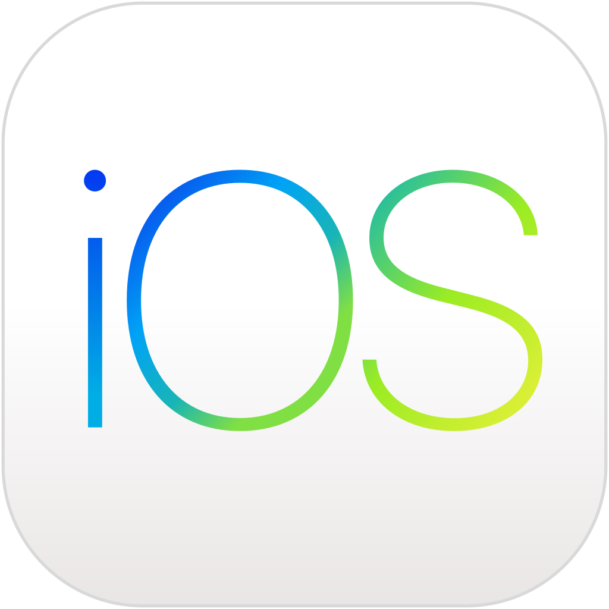

__I__ am going to discuss about _markdown_ in here, this is ***all*** about explaining __markdown__.

# Header 1
## Header 2

>Practice, practice and practice

~~Lazy~~

### Create markdown unordered list

- The first element
   - HTML, CSS and Javascript
- The second element
   - JS Framework

+ Quan
   + CaoAnhQuan
+ Anh
   + AnhQuanCao
+ Cao

* Front end 
* Back end

### Create markdown ordered list

1. Apple
   1. Iphone
   2. Macbook
2. Microsoft
3. Google
4. Oracle

### Checkbox

- [ ] Task 1
- [ ] Task 2

### Create a markdown table and link reference

Android | iOS | Windows
:--- | :---: | ---:
Medium App for Android | *Medium App for iOS* | **Medium App for Windows**
Java, Android Studio, Samsung mobile phone | Swift, iOS App | C#, .NET
[Play Store](https://play.google.com/store) | [App Store](https://www.apple.com/au/ios/app-store/) | [Microsoft Store](https://www.microsoft.com/en-au/store/apps/windows)
 |  | 
